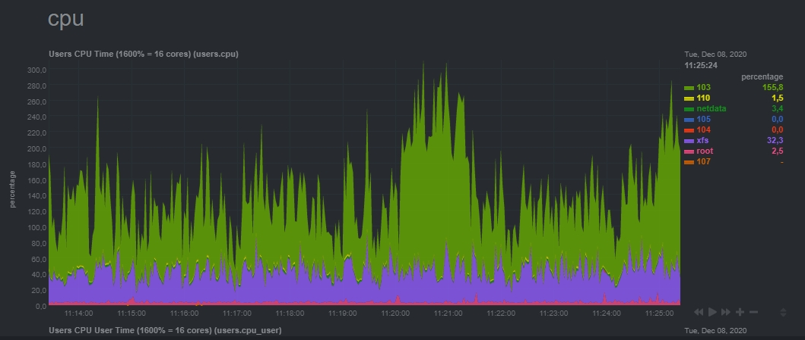
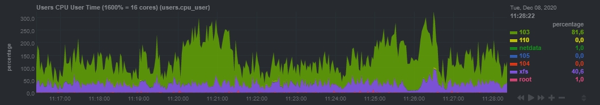
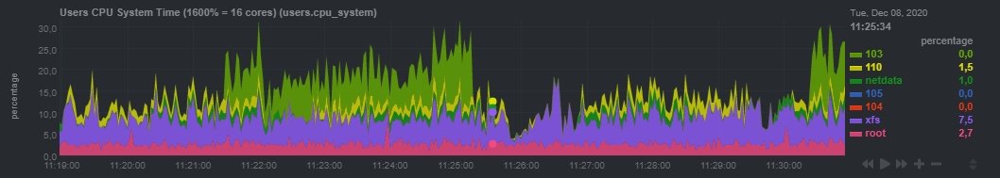

# System Overview

---

# CPUs

Подробная информация для каждого процессора системы. Краткое описание системы для всех процессоров можно найти в
разделе [Обзор системы](#System Overview).

Графики в разделе:

## Utilization - процент нагрузки на каждое ядро, разбит по процессам

- `User`: ЦП выполняет код в пользовательском режиме. Это включает в себя код вашего приложения. Обратите внимание, что
  если приложение пытается читать с диска или записывать в сеть, оно фактически переходит в спящий режим, пока ядро
  выполняет эту работу, и снова пробуждает приложение.

- `System`: ЦП выполняет код ядра. Сюда входят драйверы устройств и модули ядра.

- `Nice`: Код пользователя может выполняться с «нормальным» приоритетом или с различной степенью приоритета «ниже
  нормального». Вы можете, например, запустить какой-то процесс создания отчета с более низким приоритетом, а
  интерактивные процессы — с обычным приоритетом. `Nice` - когда ЦП выполняет пользовательскую задачу с приоритетом ниже
  нормального.

- `I/O Wait`: Иногда процессору остается только одно — ждать результатов чтения / записи диска / сети. Это не так уж
  редко, как вы думаете. Например, файловый сервер почти всю свою жизнь будет ждать завершения чтения с диска и записи
  по сети. Ожидание ввода-вывода `I/O Wait` - это когда ЦП ожидает завершения операции ввода-вывода, и ЦП не может
  использоваться ни для чего другого.

- `Idle`: А когда ядро действительно ничего не может сделать, это просто тратит впустую этот кусок времени. Технически,
  когда исполняемая очередь пуста и не выполняются операции ввода-вывода, использование ЦП помечается как `Idle`.

- `Steal`: При работе в виртуализированной среде гипервизор может «украсть» циклы, предназначенные для ваших
  процессоров, и передать их другому по разным причинам. Это время считается украденным.

И есть еще пара других типов, о которых вы, вероятно, не увидите:

- `IRQ and SoftIRQ`: Ядро обслуживает запросы прерывания (`IRQ`).
- `Guest` и `Guest Nice`: Процесс (гипервизор) запускает виртуальный ЦП. Эти номера уже включены в `User` и `Nice`.

[Подробнее](https://www.cyberciti.biz/tips/how-do-i-find-out-linux-cpu-utilization.html)
[Ещё подробнее](https://www.opsdash.com/blog/cpu-usage-linux.html)

## Interrupts - прерывания

- NMI (немаскируемые прерываний) - обрабатываются всегда, независимо от запретов на другие прерывания. К примеру, такое
  прерывание может быть вызвано сбоем в микросхеме памяти.

- RES (перепланирование прерываний) - это способ Linux kernel разбудить простаивающее CPU-ядро, чтобы запланировать
  поток на нем.

> Планировщик пытается распределить активность процессора между как можно большим количеством ядер.
> Общее эмпирическое правило состоит в том, что предпочтительнее иметь как можно больше процессов,
> работающих на всех ядрах с более низкой мощностью (более низкие тактовые частоты), а не иметь
> одно ядро, действительно занятое работой на полной скорости, в то время как другие ядра спят.
>

- LOC (локальные прерывания таймера) - это таймер, реализованный на APIC, который прерывает только определенный CPU
  вместо того, чтобы вызывать прерывание, которое может быть обработано любым CPU.

> Например, проверка, не нужно ли нам переключиться на другой процесс. это LOC прерывание

- CAL (прерывания вызова функций) - прерывания на выходе `/proc/interrupts`, может со временем уменьшаться.

> В некоторых случаях он может вести себя странно - отображать очень большие значения или быть нестабильным.

- TLB (таблица страниц)

> [wiki](https://ru.wikipedia.org/wiki/%D0%A2%D0%B0%D0%B1%D0%BB%D0%B8%D1%86%D0%B0_%D1%81%D1%82%D1%80%D0%B0%D0%BD%D0%B8%D1%86)

- MCP (Опросы для проверки машин)

## Softirq - отложенные прерывания

> Отложенная обработка прерывания предполагает, что некоторая часть действий по обработке
> результатов прерывания может быть отложена на более позднее время, когда ядро системы будет
> менее загружено или будет находиться в более стабильном состоянии.

- TIMER (Обработчик прерываний таймера)
- NET_TX (Отправка сетевых пакетов)
- NET_RX (Прием сетевых пакетов)
- TASKLET

> Тасклеты — это механизм обработки нижних половин, построенный на основе механизма отложенных прерываний.
> Как уже отмечалось, они не имеют ничего общего с заданиями (task). Тасклеты по своей природе и
> принципу работы очень похожи на отложенные прерывания. Тем не менее они имеют более простой
> интерфейс и упрощенные правила блокировок.

- SCHED (выбирает для выполнения следующий процесс)

- RCU (Read-Copy-Update, RCU (Чтение-модификация-запись) [wiki](https://ru.wikipedia.org/wiki/Read-copy-update)

> Механизм синхронизации в многопоточных системах. Реализует неблокирующую синхронизацию для
> всех читателей структуры данных. Запись может производиться параллельно чтению, однако
> одновременно может быть активен только один писатель.

## Softnet

> Статистика SoftIRQ по ядрам ЦП, связанных с работой сети. Итого для всех ядер ЦП можно найти в статистике
> [System / softnet statistics] (#menu_system_submenu_softnet_stat).

- `processing` указывает количество обработанных пакетов

- `dropped` - это количество пакетов, отброшенных из-за переполнения журнала сетевого устройства
  (для исправления в Linux используйте sysctl для увеличения net.core.netdev_max_backlog)

- `squeezed` - это количество пакетов, отброшенных из-за ограничения сетевого устройства
  (чтобы исправить их в Linux, используйте sysctl для увеличения net.core.netdev_budget и / или
  net.core.netdev_budget_usecs).

> Дополнительную информацию о выявлении и устранении проблем, связанных с сетевым драйвером, можно найти в
> [Руководстве по настройке производительности сети Red Hat Enterprise Linux.](https://access.redhat.com/sites/default/files/attachments/20150325_network_performance_tuning.pdf)

## Throttling - Основные события теплового регулирования (cpu.core_throttling) по ядрам. Понижение частоты из-за перегрева.

## Cpufreq - Текущая частота процессора (cpu.cpufreq) по ядрам

## Cpuidle по времени пребывания в states C (cpu.cpu0_cpuidle)

> Фактически, у большинства процессоров есть несколько способов ничего не делать более эффективно. Эти режимы ожидания,
> которые называются `C состояниями`, различаются по величине сэкономленной энергии, но также и по количеству
> вспомогательной информации, которая может быть потеряна, и по времени, необходимому для возврата в полнофункциональный режим.
> Чем глубже `C состояние`, тем больше вещей отключается, больше состояний теряется
> [Статья на тему](https://elinux.org/images/8/86/CPU_idle.pdf)

- `POLL` - активен `processor.max_cstate=1`
- `C1`, `C2` экономят электроэнергию, сохраняя большую часть состояния процессора
- `C3`, `C6` и `TLB` Кэш очищаются
- `C6` также с силовым закрытием

---

# Users

Статистика по пользователям собирается с помощью плагина `netdata` `apps.plugin`. Этот плагин просматривает все процессы
и собирает статистику по каждому пользователю.

Отчёт по значениям совпадает с теми, что выводить команда `top`, хотя плагин `netdata` также считает ресурсы дочерних
процессов (в отличие от `top`, который показывает только ресурсы текущих запущенных процессов). Таким образом, для
процессов `shell scripts`, график так же содержит затрачиваемые ресурсы, используемые командами, которые эти сценарии
запускают в каждом временном интервале.

## Сpu

> Если установить через docker, есть проблема т.к. имя пользователя, `netdata` получат `getpwuid()`
> (а она видет только локальных пользоватлей), то вместо имён будут `uid`.
> [Решение проблемы](https://github.com/netdata/netdata/pull/6472)
> - Как узнать uid пользователя по имени `id -u mysql`
> - Как узнать имя пользователя по uid `id -nu 103`

### Время ЦП пользователей (1600% = 16 ядер) (users.cpu)

### Пользовательское время ЦП пользователей (1600% = 16 ядер) (users.cpu_user)

### Системное время процессора пользователей (1600% = 16 ядер) (users.cpu_system)

---

# MySQL db

Метрики производительности для mysql, системы управления реляционными базами данных с открытым исходным кодом (СУБД).

## Bandwidth - пропускная способность

Объем данных, отправленных клиентам mysql `out` и полученных от клиентов mysql `in`.

## Queries - запросы

Количество операторов, выполненных сервером.

- queries: считает выполненные инструкции, выполняемые в хранимых SQL-программах.
- questions: подсчитывает операторы, отправленные на сервер mysql клиентами mysql.
- slow queries: подсчитывают количество операторов, выполнение которых заняло более `long_query_time` секунд. Для
  получения дополнительной информации о медленных запросах проверьте журнал медленных запросов mysql.

## Query types - типы запросов (select|delete|update|insert и т.д))

## Handlers - обработчики

Использование внутренних обработчиков mysql. Эта диаграмма дает очень хорошее представление о том, что на самом деле
делает сервер mysql.
(если диаграмма не показывает все эти измерения, это потому, что они равны нулю — установите *Which dimensions to show?*
в *All* в настройках панели инструментов, чтобы отображать даже нулевые значения)

- `commit`: количество внутренних операторов [COMMIT](https://dev.mysql.com/doc/refman/8.0/en/commit.html).
- `delete`: количество раз, когда строки были удалены из таблиц.
- `prepare`: счетчик для фазы подготовки [двухфазных операций фиксации](https://dev.mysql.com/doc/refman/8.0/en/xa.html)
- `read first`: количество раз, когда была прочитана первая запись в указателе. Высокое значение предполагает, что
  сервер выполняет много сканирований полного индекса; например `SELECT col1 FROM foo` с индексированным `col1`.
- `read key`: количество запросов на чтение строки на основе ключа. Если это значение велико, это хороший показатель
  того, что ваши таблицы правильно проиндексированы для ваших запросов.
- `read next`: количество запросов на чтение следующей строки в ключевом порядке. Это значение увеличивается, если вы
  запрашиваете индексный столбец с ограничением диапазона или, если вы выполняете сканирование индекса.
- `read prev`: количество запросов на чтение предыдущей строки в ключевом порядке. Этот метод чтения в основном
  используется для оптимизации `ORDER BY ... DESC`.
- `read rnd`: количество запросов на чтение строки на основе фиксированной позиции. Высокое значение указывает на то,
  что вы выполняете множество запросов, требующих сортировки результатов. Вероятно, у вас есть много запросов, которые
  требуют, чтобы MySQL сканировал целые таблицы, или у вас есть соединения, которые не используют должным образом ключи.
- `read rnd next`: количество запросов на чтение следующей строки в файле данных. Это значение будет высоким, если вы
  выполняете много сканирований таблиц. Обычно это говорит о том, что ваши таблицы не проиндексированы должным образом
  или что ваши запросы не написаны для использования имеющихся у вас индексов.
- `rollback`: количество запросов к механизму хранения на выполнение операции отката.
- `savepoint`: количество запросов к подсистеме хранения для размещения точки сохранения.
- `savepoint rollback`: количество запросов к подсистеме хранения на откат к точке сохранения.
- `update`: количество запросов на обновление строки в таблице.
- `write`: количество запросов на вставку строки в таблицу.

[Расшифровка всех параметров](https://dev.mysql.com/doc/mysql-em-plugin/en/myoem-metric-mysqlserver-handleractivity-category.html)

---